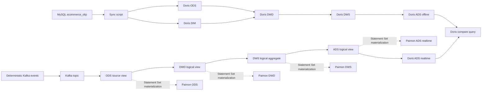

# 架构说明

## MVP 架构

## 第一版取舍

- MySQL 负责模拟真实电商业务库，当前包含交易事件表和 SKU 维表。
- Doris 离线链路完整保留 `ODS -> DIM/DWD -> DWS -> ADS`，用于展示传统离线数仓建模能力。
- Paimon 链路使用 Flink SQL + Filesystem Catalog，避免第一阶段引入 Hive Metastore/HDFS。
- 实时侧在一个 Flink Statement Set 中通过临时视图形成 DWD/DWS/ADS 逻辑加工链，并把 ODS/DWD/DWS/ADS 结果并行物化到 Paimon；当前不是逐层读取 Paimon 表的多作业链路。
- 最终 ADS 通过 Doris Flink Connector 回写 Doris。
- Doris 统一查询通过离线 ADS 和实时 ADS 对账实现。
- DolphinScheduler、Hudi、Iceberg 保留为增强方向，不进入第一阶段强依赖。

## 面试表达重点

- 同一个指标口径在两套链路中实现，重点是结果对齐，不是堆组件。
- Doris 适合作为高并发 OLAP 查询层和统一指标展示层。
- Paimon 在本项目中保存 ODS/DWD/DWS/ADS 的物化结果；当前版本尚未验证跨作业逐层消费和故障回放。
- 第一版用 Filesystem Catalog 是为了降低本地复现成本；生产环境可替换为 Hive Metastore、对象存储、Doris Catalog 或 Trino 查询。
- MySQL 业务库和 Kafka 事件在本项目中使用同一份确定性样例，目的是让离线和实时链路可稳定对账。
- 1 / 7 / 30 日指标使用固定日期锚点下的统计范围持续聚合，没有使用 Window TVF；当前不把未实现的事件时间窗口、迟到数据处理写成已完成能力。
